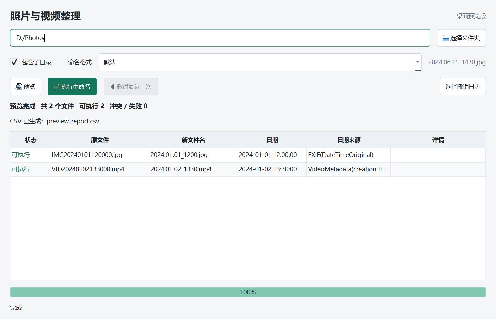

# Photo & Video Renamer

按拍摄日期批量重命名照片与视频，面向本地文件夹、同步盘和 NAS。
Python 核心提供 CLI 与 Textual 完整管理界面，PySide6 提供新的桌面主窗口。

**当前：2.9.0-preview.1，Windows x64 桌面预览版。**



## 下载与运行

从 [GitHub Releases](https://github.com/bankroz/Rename_organize_pictures/releases)
下载 `photo-renamer-2.9.0-preview.1-windows-x64.zip`，完整解压后双击
`photo_renamer_desktop.exe`，无需安装 Python。

必须保留整个解压目录：`_internal/` 是运行库，`patterns.json` 是可编辑配置。
不要只复制 EXE，不要直接在压缩包中运行，建议放在当前用户可写目录。
Release 附带 SHA256 校验文件。

旧 `win/` 已移除，其 20 条规则已合并到根目录配置；宣传 PDF 保留在
[历史资料](docs/archive/photo_renamer_promo.pdf)。可执行包改由 Release 附件分发，
不再提交新的 EXE 到 Git；既有历史不做强制改写。

## 功能范围

| 功能 | PySide6 桌面预览版 | Textual |
|---|---|---|
| 目录选择 / 完整路径拖放替换 | 支持系统拖放 | 拖放取决于终端 |
| 包含子目录 / 输出格式选择 | 支持，子目录默认选中 | 支持 |
| 启动默认格式记忆 | 用户选择后写入 JSON | 支持 |
| 预览 / 执行 / 进度 / CSV 链接 | 支持 | 支持 |
| 按执行日志撤销 | 最近一次 / 选择 CSV | 最近一次 / 历史入口 |
| 陌生规则发现、逐条加入 JSON | 待迁移 | 支持 |
| 规则和输出格式编辑删除 | 待迁移 | 支持 |
| 完整历史列表 | 待迁移 | 支持 |

## 日期与读取原则

日期优先级：**内部元数据 → Unix 时间戳文件名 → 普通日期文件名 → 文件属性时间**。
图片读取 EXIF，视频读取容器/流级日期；Windows/macOS 优先创建时间，缺失时回退修改时间。
时间戳文件名也可人为修改，优先级不代表不可伪造。

默认命名为 `YYYY.MM.DD_HHMM`。同名尝试分钟偏移；无法分配唯一名称时报告冲突，不覆盖文件。
图片仅尝试 256 KB / 1 MB 头部，视频先查询容器日期、缺失时再查流级日期并设置短超时。
不为改名或撤销计算整文件哈希。不同容器和网盘客户端的实际下载量可能不同，
ffprobe 超时不等于严格的字节读取上限。TIFF 已有回归验证，其他 RAW/HEIC 等格式仍需覆盖验证。

## 配置

绿色版优先读 EXE 同目录 `patterns.json`；源码可用 `--pattern-config` 指定配置。

| 字段 | 用途 |
|---|---|
| `patterns` | 输入识别规则，当前随包提供 20 条 |
| `output_formats` | 自定义输出格式，与输入规则列表不同 |
| `current_output_format_name` | 启动选中的格式名称 |
| `default_output_format` | 默认 strftime 表达式 |
| `video_metadata_timeout_seconds` | 视频读取超时，默认 3 秒，优先于环境变量 |

每次预览/执行重新加载规则；JSON 保存使用原子替换。规则按数组顺序匹配，精确规则应在宽泛规则前。
ID 是标识，不代表规则数量。日期来源和时区依赖媒体元数据与本机设置，请检查预览。

## 日志与安全边界

- 每次执行生成唯一 `rename_log_时间_标识.csv`，操作前后追加并刷新记录。
- `pending` 表示操作前记录，`ok` 表示完成，同一原路径以最后记录为准。
- `preview_report.csv` 只是计划，禁止撤销；再次预览不替换最近执行记录。
- 中断后可选执行日志恢复已经完成的改名。新日志按文件标识、大小、修改时间核验；
  文件被替换或同步导致标识变化时保守拒绝。旧日志缺少身份字段，保护较弱。
- 撤销不覆盖原位置已有文件，`--undo-force` 也不再删除冲突文件；复制模式不按原地改名撤销。
- 失败文件保留失败行，同名未变更显示“无需改名”。
- 文件变更在后台等待真实结果，不将等待超时误报为失败。网络操作可能长期等待，
  界面保持响应，但不能承诺安全强制取消底层 I/O。
- 任务互斥限单进程，不要同时用多个实例处理同一文件夹。

请先用媒体副本试用。当前未完成真实断网、干净电脑、macOS/Linux、签名和正式客户发布验收。

## 源码运行

当前桌面预览版源码使用 Python 3.14；发布包内置 Python 3.14.3。
旧版 Python 在英文 Windows 上可能无法处理中文 strftime 字面量，本版不将其列为已验证运行环境。

```powershell
python -m venv .venv
.venv\Scripts\Activate.ps1
python -m pip install -r requirements-gui.txt -r requirements-tui.txt
python photo_renamer_gui.py
python photo_renamer.py --tui
python photo_renamer.py -s "D:\Photos" -m preview -r
python photo_renamer.py -s "D:\Photos" -m execute -r
python photo_renamer.py --undo-csv "D:\Photos\rename_log_实际文件名.csv"
```

源码的视频识别需要 PATH 中的 ffprobe；Release 已内置。完整参数见 `python photo_renamer.py --help`。

## 项目结构

```text
photo_renamer.py          # 识别、文件操作、CSV、CLI 服务
photo_renamer_gui.py      # PySide6 主窗口
photo_renamer_tui.py      # Textual 完整管理界面
desktop_smoke.py          # 独立 EXE 自检，使用临时生成文件
patterns.json            # 唯一随包默认配置
VERSION                  # 发布版本
requirements-*.txt       # 界面与构建依赖
scripts/                 # 启动、构建、打包
packaging/               # PyInstaller 配置
tests/                   # 核心与界面回归
docs/                    # 说明、截图、历史资料
.github/workflows/       # CI 与手动构建
dist/                    # 本地产物，不提交 Git
build/                   # 构建缓存、自检证据，不提交 Git
```

测试素材、个人历史、原始媒体和开发工具目录不随源码或 Release 分发。
参见 [开发说明](CONTRIBUTING.md)、[发布流程](docs/RELEASING.md)、
[变更记录](CHANGELOG.md)、[迁移边界](docs/DESKTOP_PREVIEW.md) 和 [第三方说明](THIRD_PARTY_NOTICES.md)。
本仓库尚未指定项目自身的开源许可证，第三方组件遵循各自许可证。
